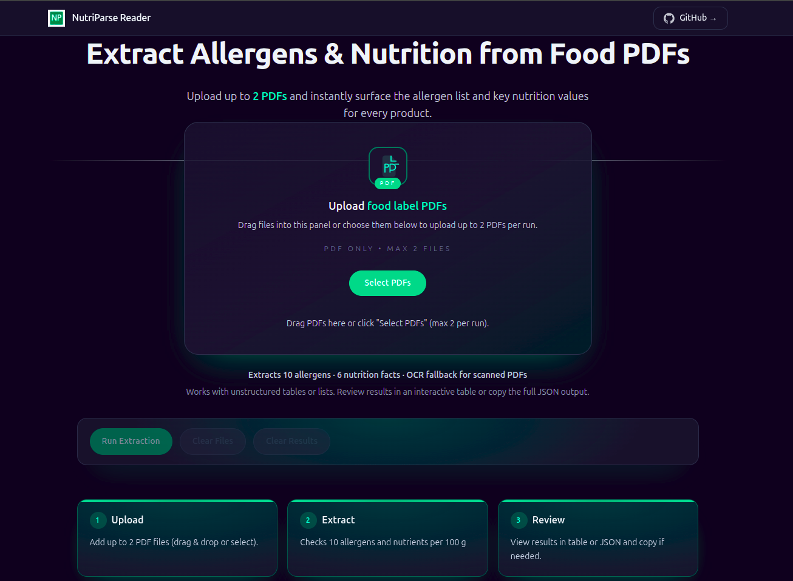
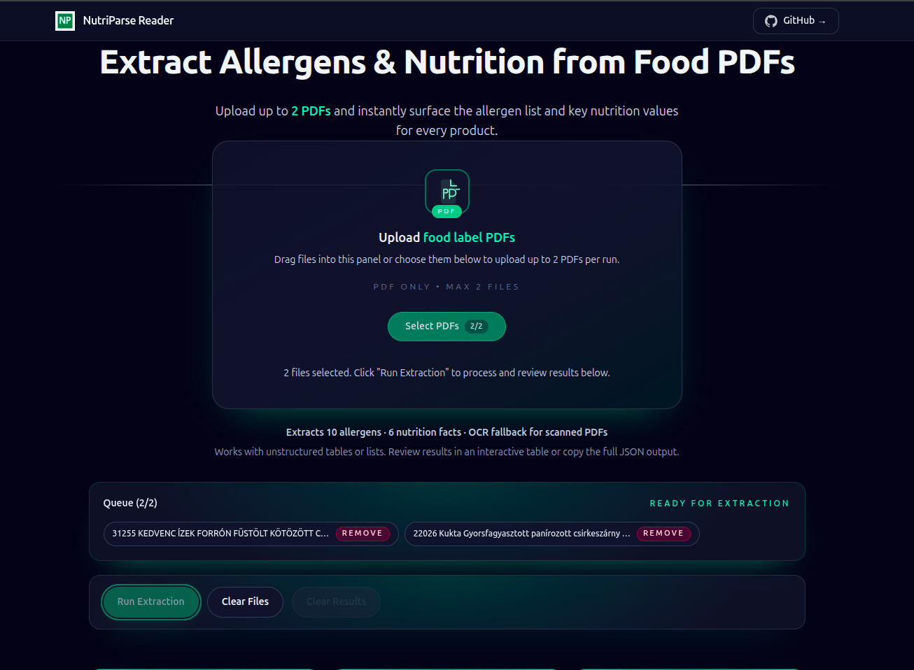
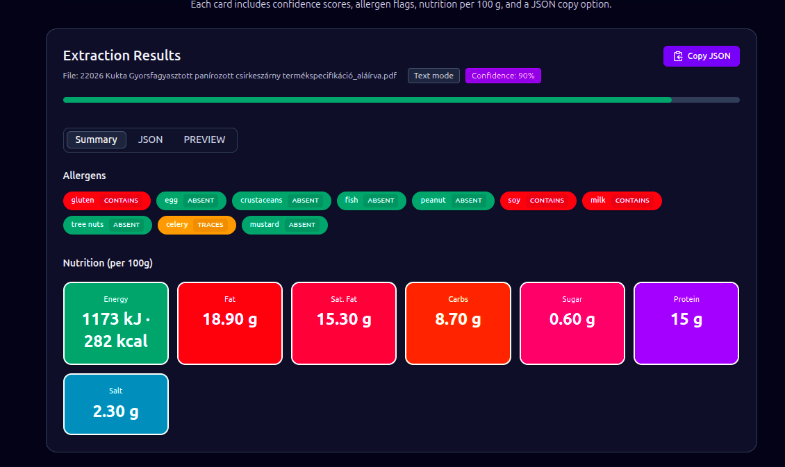

<h1 align="center">NutriParse Reader</h1>

<p align="center">
  Developer Test Project · University of Debrecen · 2025
</p>

---

## Project Overview

NutriParse Reader is a full-stack web application that automatically extracts allergen statements and nutrition facts from food product PDFs. Both digitally generated PDFs and scanned/image-based PDFs are supported. The backend uses AI-augmented parsing (rule-based extraction with LLM assistance) to detect allergens and nutrition values, while the frontend presents the results in both table and JSON formats for quick review.

---

## Features

- Upload up to **two PDFs per run** using drag & drop or a file picker.
- Backend processing with AI/LLM logic to interpret ingredient statements and nutrition tables.
- Extraction of the **10 required allergens**: Gluten, Egg, Crustaceans, Fish, Peanut, Soy, Milk, Tree nuts, Celery, Mustard.
- Extraction of the **6 nutrition values**: Energy, Fat, Carbohydrate, Sugar, Protein, Sodium.
- Structured output in a responsive **table view** plus a raw **JSON view**.
- Automatic **OCR fallback** for scanned or photo-based PDFs.

---

## Tech Stack

| Layer     | Technologies |
|-----------|--------------|
| Frontend  | Next.js (React), Tailwind CSS |
| Backend   | FastAPI (Python) |
| OCR       | Tesseract via `pytesseract` |
| Parsing   | Custom allergen & nutrition parsers with LLM assistance |

---

## Installation & Usage

1. **Clone the repository**
   ```bash
   git clone https://github.com/amiltonkoxi/nutriparse-reader.git
   cd nutriparse-reader
   ```

2. **Install backend dependencies**
   ```bash
   cd backend
   python3 -m venv .venv
   source .venv/bin/activate        # Windows: .venv\Scripts\activate
   pip install -r requirements.txt
   ```

3. **Start the backend**
   ```bash
   uvicorn app.main:app --reload
   ```

4. **Install frontend dependencies**
   ```bash
   cd ../frontend
   npm install
   echo "NEXT_PUBLIC_API_BASE=http://127.0.0.1:8000" > .env.local
   ```

5. **Start the frontend**
   ```bash
   npm run dev
   ```

6. **Open the app**
   Visit `http://localhost:3000` in your browser, select up to two PDFs, and inspect the extracted data.

---

## Screenshots

| Preview | Description |
|---------|-------------|
|  | **Homepage (dark theme)** showing upload panel, queue, and action buttons. |
|  | **Dropping PDFs** – drag & drop interaction with two documents selected. |
|  | **Extraction view** – tabbed table/JSON results, confidence, and evidence. |

---

## Deliverables Mapping

| Assignment Deliverable | Status |
|------------------------|--------|
| Source code            | ✅ Included in this repository (frontend + backend). |
| Documentation          | ✅ This README provides setup, architecture, and usage details. |
| Demonstration video    | 🔧 *To be added.* Recording will showcase upload and extraction flow. |
| Live deployment URL    | 🔧 *To be added.* Hosted version will be linked once deployed. |

---

## License & Acknowledgments

- **License:** MIT License — see `LICENSE`.
- **Acknowledgment:** This project implements the developer assignment described by **Dr. Tamás Bérczes** (University of Debrecen, 2025). Many thanks for the detailed specification and guidance.

---

NutriParse Reader · 2025
