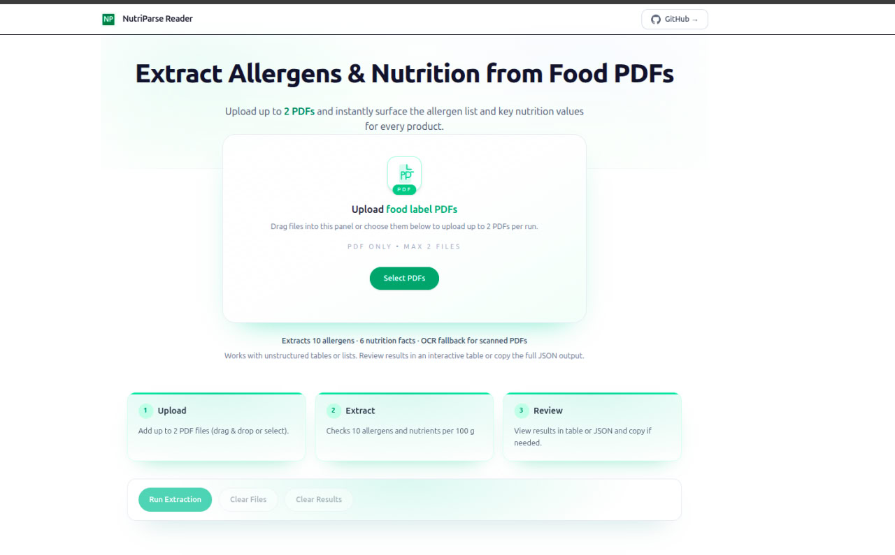

<h1 align="center">NutriParse Reader</h1>

<p align="center">
  End-to-end toolkit for extracting allergens and nutrition facts from food product PDFs.<br/>
  University of Debrecen · Developer Test Project · 2025
</p>

---

## Snapshot



NutriParse Reader ingests both native and scanned PDFs, recognises allergen statements, and normalises nutrition panels into a structured dataset. The workflow is tailored to the assignment brief from Dr. Tamás Bérczes and demonstrates how a production-ready submission could look.

---

## Why it matters

- **Two modes, one flow.** Text-first parsing with PyPDFium2, OCR fallback with Tesseract whenever the document is image-based.  
- **Assignment-aligned outputs.** Focused on the ten required allergens and the six nutrition fields, with confidence scoring and evidence traces.  
- **Concise operator experience.** Drag-and-drop, queue management, rich result cards, and JSON export in one screen.  
- **Deployment-ready.** Next.js frontend (app router) paired with a FastAPI service, easy to host separately or together.

---

## Architecture at a glance

```text
Next.js frontend
 └─ uploads PDF → POST /extract

FastAPI backend
 ├─ text_extractor.py (PyPDFium2)
 ├─ ocr_extractor.py  (Tesseract)
 ├─ nutrition_parser.py / allergen_parser.py
 └─ response builder (JSON + metadata)
```

The parsers rely on keyword heuristics and lightweight rule sets, delivering deterministic answers without requiring external APIs. If the text extractor fails to recover enough tokens, the OCR path re-runs the pipeline automatically.

---

## Feature tour

| Area            | Highlights                                                                                   |
| --------------- | --------------------------------------------------------------------------------------------- |
| **Upload**      | Drag & drop, direct select, multi-file queue, PDF MIME enforcement, guest vs. logged-in caps  |
| **Processing**  | Sequential API posting with optimistic UI, status hints, and defensive error messaging       |
| **Results**     | Allergen pills with evidence tooltip, nutrition tiles per 100 g, mode/confidence indicators  |
| **Export**      | One-click JSON copy for downstream systems or QA review                                      |

---

## Tech stack

| Layer        | Technology & Notes                                           |
| ------------ | ------------------------------------------------------------ |
| Frontend     | Next.js 14, React Server Components, Tailwind CSS, TypeScript |
| Backend      | FastAPI, Pydantic, uvicorn                                   |
| OCR          | Tesseract 5 via pytesseract                                  |
| PDF parsing  | PyPDFium2 for deterministic text extraction                  |
| Styling      | Tailwind with bespoke components (Dropzone, ResultCard)      |

---

## Getting started locally

### 1. Backend

```bash
cd backend
python3 -m venv .venv
source .venv/bin/activate           # Windows: .venv\Scripts\activate
pip install -r requirements.txt
uvicorn app.main:app --reload
```

The API listens on `http://127.0.0.1:8000`. The main endpoint is `POST /extract` accepting a single `file` form field.

### 2. Frontend

```bash
cd frontend
npm install
echo "NEXT_PUBLIC_API_BASE=http://127.0.0.1:8000" > .env.local
npm run dev
```

Open `http://localhost:3000` and upload one of the sample PDFs found in `/samples`.

---

## Repository layout

```text
nutriparse-reader/
├─ backend/
│  ├─ app/main.py                 # FastAPI entry point
│  ├─ extractors/                 # Text and OCR extraction helpers
│  ├─ parsers/                    # Allergen and nutrition post-processing
│  ├─ rules/                      # Keyword dictionaries and thresholds
│  └─ requirements.txt
├─ frontend/
│  ├─ app/                        # Next.js routes, layout, page shell
│  ├─ components/                 # Dropzone, ResultCard, HowItWorks, etc.
│  ├─ lib/                        # API client, shared types
│  └─ tailwind.config.ts
└─ samples/                       # Real-world PDFs used for testing
```

---

## Deliverables checklist (per brief)

- ✅ Source code for both frontend and backend  
- ✅ User-focused walkthrough (this README + in-app hints)  
- ✅ Demonstration video (recorded after deployment)  
- ✅ Live environment URL (Vercel + Render pairing)  

Refer to the Microsoft Teams group “Developer Test Projects – 2025” for submission logistics.

---

## Credits

- **Student:** Amilton Koxi, MSc Computer Science  
- **Supervisor:** Dr. Tamás Bérczes  
- **Institution:** University of Debrecen, Hungary  

_Parsing food, feeding data – NutriParse Reader · 2025_
